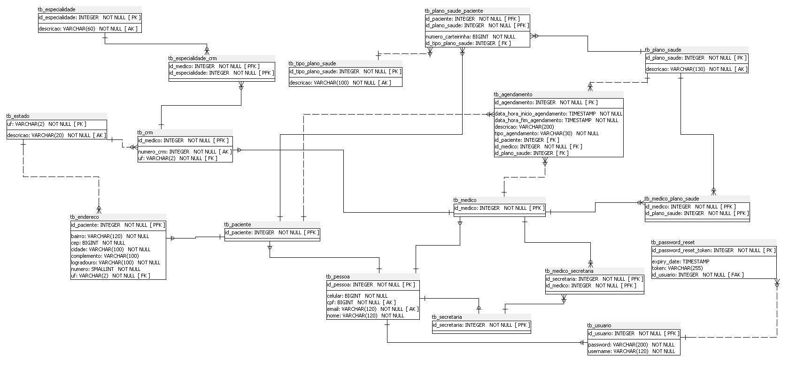

<html lang="pt-br">
    <body>
        <h1>Medlinked</h1>
        <h3>Índice:</h3>
        <ul>
            <li>
<a style="text-decoration:none; color:white;" href="#descricao_projeto">Descrição Projeto</a>
</li>
            <li>
<a style="text-decoration:none; color:white;" href="#tecnologias">Tecnologias Utilizadas</a>
</li>
            <li>
<a style="text-decoration:none; color:white;" href="#modelo">Modelo de Banco de Dados do Projeto</a>
</li>
            <li>
                
<a style="text-decoration:none; color:white;" href="#funcionalidades">Funcionalidades implementadas</a>

                <ul>
                    <li>
                        
<a style="text-decoration:none; color:white;" href="#secretaria">SecretariaController</a>

                        <ul>
                            <li>
<a style="text-decoration:none; color:white;" href="#create-secretaria">Criar Secretária</a>
</li>
                            <li>
<a style="text-decoration:none; color:white;" href="#update-secretaria">Editar Secretária</a>
</li>
                            <li>
<a style="text-decoration:none; color:white;" href="#get-secretaria">Retornar Secretária</a>
</li>
                            <li>
<a style="text-decoration:none; color:white;" href="#delete-secretaria">Deletar Secretária</a>
</li>
                        </ul>
                    </li>
                    <li>
                        
<a style="text-decoration:none; color:white;" href="#usuario">UsuarioController</a>

                        <ul>
                            <li>
<a style="text-decoration:none; color:white;" href="#autenticar-usuario">Autenticar Usuário</a>
</li>
                            <li>
<a style="text-decoration:none; color:white;" href="#alterar-senha">Alterar Senha Usuário</a>
</li>
                        </ul>
                    </li>
                    <li>
                        
<a style="text-decoration:none; color:white;" href="#planosaude">PlanoSaudeController</a>

                        <ul>
                            <li>
<a style="text-decoration:none; color:white;" href="#create-plano">Criar Plano de Saúde</a>
</li>
                            <li>
<a style="text-decoration:none; color:white;" href="#get-planos">Retornar Planos de Saúde sem Paginação</a>
</li>
                            <li>
<a style="text-decoration:none; color:white;" href="#get-planos-paginado">Retornar Planos de Saúde com Paginação</a>
</li>
                            <li>
<a style="text-decoration:none; color:white;" href="#delete-plano">Deletar Plano de Saúde</a>
</li>
                        </ul>
                    </li>
                    <li>
                        
<a style="text-decoration:none; color:white;" href="#paciente">PacienteController</a>

                        <ul>
                            <li>
<a style="text-decoration:none; color:white;" href="#create-paciente">Criar Paciente</a>
</li>
                            <li>
<a style="text-decoration:none; color:white;" href="#get-paciente">Retornar Paciente</a>
</li>
                            <li>
<a style="text-decoration:none; color:white;" href="#update-paciente">Alterar Paciente</a>
</li>
                            <li>
<a style="text-decoration:none; color:white;" href="#get-pacientes">Retornar Pacientes sem Paginação</a>
</li>
                            <li>
<a style="text-decoration:none; color:white;" href="#get-pacientes-paginado">Retornar Pacientes com Paginação</a>
</li>
                            <li>
<a style="text-decoration:none; color:white;" href="#delete-paciente">Deletar Paciente</a>
</li>
                        </ul>
                    </li>
                    <li>
                        
<a style="text-decoration:none; color:white;" href="#medico">MedicoController</a>

                        <ul>
                            <li>
<a style="text-decoration:none; color:white;" href="#create-medico">Criar Médico</a>
</li>
                            <li>
<a style="text-decoration:none; color:white;" href="#get-medicos">Retornar Médicos</a>
</li>
                            <li>
<a style="text-decoration:none; color:white;" href="#get-medico">Retornar Médico</a>
</li>
                            <li>
<a style="text-decoration:none; color:white;" href="#update-medico">Alterar Médico</a>
</li>
                            <li>
<a style="text-decoration:none; color:white;" href="#delete-medico">Deletar Médico</a>
</li>
                        </ul>
                    </li>
                    <li>
                        
<a style="text-decoration:none; color:white;" href="#pessoa">PessoaController</a>

                        <ul>
                            <li>
<a style="text-decoration:none; color:white;" href="#pessoa-cpf">Procurar Pessoa por CPF</a>
</li>
                        </ul>
                    </li>
                    <li>
                        
<a style="text-decoration:none; color:white;" href="#agendamento-automatico">AgendamentoAutomaticoController</a>

                        <ul>
                            <li>
<a style="text-decoration:none; color:white;" href="#create-agenda">Criar Agenda(Agendamentos Automáticos)</a>
</li>
                        </ul>
                    </li>
                    <li>
                        
<a style="text-decoration:none; color:white;" href="#agendamento">AgendamentoController</a>

                        <ul>
                            <li>
<a style="text-decoration:none; color:white;" href="#create-agendamento">Criar Agendamento Único</a>
</li>
                            <li>
<a style="text-decoration:none; color:white;" href="#update-agendamento">Alterar Agendamento</a>
</li>
                            <li>
<a style="text-decoration:none; color:white;" href="#get-agendamento">Retornar Agendamento</a>
</li>
                            <li>
<a style="text-decoration:none; color:white;" href="#get-agendamentos-paginado">Retornar Agendamentos de Médicos de uma Secretária com Paginação</a>
</li>
                            <li>
<a style="text-decoration:none; color:white;" href="#get-agendamentos">Retornar Agendamentos de Médicos de uma Secretária sem Paginação</a>
</li>
                            <li>
<a style="text-decoration:none; color:white;" href="#delete-agendamento">Deletar Agendamento</a>
</li>
                        </ul>
                    </li>
                    <li>
                        
<a style="text-decoration:none; color:white;" href="#planosaude-paciente">PlanoSaudePacienteController</a>

                        <ul>
                            <li>
<a style="text-decoration:none; color:white;" href="#associate-plano-paciente">Associar Plano de Saúde a Paciente</a>
</li>
                            <li>
<a style="text-decoration:none; color:white;" href="#disassociate-plano-paciente">Desassociar Plano de Saúde de Paciente</a>
</li>
                            <li>
<a style="text-decoration:none; color:white;" href="#get-planos-paciente">Retornar Planos de Saúde de Paciente</a>
</li>
                            <li>
<a style="text-decoration:none; color:white;" href="#get-planos-paciente-medico">Retornar Planos de Saúde de Paciente em comum com Médico</a>
</li>
                        </ul>
                    </li>
                    <li>
                        
<a style="text-decoration:none; color:white;" href="#planosaude-medico">PlanoSaudeMedicoController</a>

                        <ul>
                            <li>
<a style="text-decoration:none; color:white;" href="#associate-plano-medico">Associar Planos de Saúde a Médico</a>
</li>
                            <li>
<a style="text-decoration:none; color:white;" href="#disassociate-plano-medico">Desassociar Planos de Saúde de Médico</a>
</li>
                            <li>
<a style="text-decoration:none; color:white;" href="#get-planos-medico-paginado">Retornar Planos de Saúde Médico com Paginação</a>
</li>
                        </ul>
                    </li>
                    <li>
                        
<a style="text-decoration:none; color:white;" href="#secretaria-medico">SecretariaMedicoController</a>

                        <ul>
                            <li>
<a style="text-decoration:none; color:white;" href="#associate-secretaria-medico">Associar Secretária ao Médico</a>
</li>
                            <li>
<a style="text-decoration:none; color:white;" href="#disassociate-secretaria-medico">Desassociar Secretária de Médico</a>
</li>
                            <li>
<a style="text-decoration:none; color:white;" href="#get-secretaria-medicos-paginado">Retornar Médicos de uma Secretária com Paginação</a>
</li>
                            <li>
<a style="text-decoration:none; color:white;" href="#get-secretaria-medicos">Retornar Médicos de uma Secretária sem Paginação</a>
</li>
                        </ul>
                    </li>
                    <li>
                        
<a style="text-decoration:none; color:white;" href="#passwordresettoken">PasswordResetTokenController</a>

                        <ul>
                            <li>
<a style="text-decoration:none; color:white;" href="#email-senha">Enviar email para redefinir senha</a>
</li>
                            <li>
<a style="text-decoration:none; color:white;" href="#verifica-token">Verificar token para redefinir senha</a>
</li>
                            <li>
<a style="text-decoration:none; color:white;" href="#salva-senha-token">Salvar nova senha de usuário utilizando token</a>
</li>
                        </ul>
                    </li>
                    <li>
                        
<a style="text-decoration:none; color:white;" href="#especialidade">EspecialidadeController</a>

                        <ul>
                            <li>
<a style="text-decoration:none; color:white;" href="#get-especialidades">Retornar todas as Especialidades</a>
</li>
                        </ul>
                    </li>
                    <li>
                        
<a style="text-decoration:none; color:white;" href="#estado">EstadoController</a>

                        <ul>
                            <li>
<a style="text-decoration:none; color:white;" href="#get-estados">Retornar todos os Estados</a>
</li>
                        </ul>
                    </li>
                    <li>
                        
<a style="text-decoration:none; color:white;" href="#tipo-agendamento">TipoAgendamentoController</a>

                        <ul>
                            <li>
<a style="text-decoration:none; color:white;" href="#get-tipos-agendamento">Retornar todos os Tipos de Agendamento</a>
</li>
                        </ul>
                    </li>
                    <li>
                        
<a style="text-decoration:none; color:white;" href="#tipo-plano-saude">TipoPlanoSaudeController</a>

                        <ul>
                            <li>
<a style="text-decoration:none; color:white;" href="#get-tipos-plano-saude">Retornar todos os Tipos de Plano de Saúde</a>
</li>
                        </ul>
                    </li>
                </ul>
            </li>
        </ul>
        <h3 id="descricao_projeto">Descrição do Projeto:</h3>
        
 
            Esse projeto foi desenvolvido como backend do Projeto Integrador do 4° Período de Sistemas de Informação,
            cujo objetivo é fornecer ao usuário uma aplicação que possibilite o controle de agenda de um ou vários médicos
            para os quais uma secretária trabalha.
        

        
 
            A secretária é o usuário do sistema e poderá cadastrar médicos, pacientes, convênios e agendamentos, que seriam as consultas.
            Também é possível que a secretária se desvincule dos médicos que ela atende e se vincule a outros, caso seja necessário, para que com o vinculo
            seja possível verificar a agenda do médico vinculado, tendo em vista que os agendamentos exibidos na agenda da secretária são apenas aqueles 
            pertencentes a médicos vinculados a ela.
        

        
 
            Pode-se gerar uma agenda para vários dias, em formato
            de agendamento automático, para que a secretária preencha posteriormente as informações adicionais, mas
            caso haja algum imprevisto ou um agendamento tenha ocorrido de forma mais rápida que o esperado
            também é possível editar o agendamento, alterando suas informações e também incluir um agendamento único.
        

        
Front-end do Projeto: <a style="text-decoration:none; color:white;" href="https://github.com/LucasCCA/MedLinked-Frontend">Link para o repositório com o front-end desse projeto.</a>

        <h3 id="tecnologias">Tecnologias utilizadas:</h3>
        <ul>
            <li>Java</li>
            <li>Spring Boot</li>
            <li>PostgreSQL</li>
        </ul>
        <h3 id="modelo">Modelo de Banco de Dados do Projeto:</h3>
        
        <h3 id="funcionalidades">Funcionalidades implementadas:</h3>
        <ul>
            <li>
                <h3 id="secretaria">SecretariaController:</h3>
                <ul>
                    <li><h4 id="create-secretaria">Criar Secretária:</h4>
                    
 Método HTTP: POST 

                    

                        Rota: /secretaria/create
                    

                    

                        RequestBody: SecretariaUsuarioDto
                    

                    

                        Ao criar uma secretária será verificado o cpf informado, caso já esteja cadastrado no sistema
                        como outro tipo de pessoa, será criado um registro apenas na tabela tb_secretaria, caso contrário
                        também será criado um registro na tb_pessoa, criando a pessoa no sistema. Também é verificado se existe
                        uma secretária com aquele cpf, ou email, caso exista é estourada uma exceção, caso seja necessário criar
                        uma pessoa no sistema também será verificado se já existe alguma outra pessoa com cpf ou
                        email informado, caso exista estoura exceção. Como a secretária é o usuário do sistema, ao criá-la também
                        é criado um registro em tb_usuario, contendo username e senha informados em SecretariaUsuarioDto. A senha
                        é criptografada para ser salva no banco de dados utilizando BCrypt. No fim é retornado um token, que informa
                        o idUsuario, seu nome e seu username.
                    

                    
 Retorno: UsuarioResponseDto ou mensagem de MedLinkedException

                    </li>
                    <li><h4 id="update-secretaria">Editar Secretária:</h4>
                        
 Método HTTP: PUT 

                        

                            Rota: /secretaria/update/{idSecretaria}
                        

                        

                            RequestBody: SecretariaDto
                        

                        

                            Ao editar uma secretária, será feita um busca utilizando idSecretaria informado, caso não exista
                            nenhuma secretária com aquele id será lançada uma exceção. Caso contrário, como ela não possui atributos
                            além daqueles que se relacionam a ela a partir de Pessoa, será chamado um método que atualiza as informações
                            de Pessoa no qual são verificados email, e cpf, caso já exista uma outra pessoa com email e cpf informados
                            será estourada uma exceção. Caso contrário, serão salvas as alterações de pessoa
                            e secretária.
                        

                        
 Retorno: Secretaria ou mensagem de MedLinkedException

                    </li>
                    <li><h4 id="get-secretaria">Retornar Secretária:</h4>
                        
 Método HTTP: GET 

                        

                            Rota: /secretaria/{idSecretaria}
                        

                        

                            Nessa rota serão retornadas as informações da Secretária cujo id foi informado,
                            caso não seja encontrado será estourada uma exceção.
                        

                        
 Retorno: Secretaria ou mensagem de MedLinkedException

                    </li>
                    <li><h4 id="delete-secretaria">Deletar Secretária:</h4>
                        
 Método HTTP: DELETE 

                        

                            Rota: /secretaria/delete/{idSecretaria}
                        

                        

                            Ao deletar uma secretária, será feita um busca utilizando idSecretaria informado, caso não exista
                            nenhuma secretária com aquele id será lançada uma exceção. Caso contrário, será verificado se ela possui
                            algum vinculo com médico, se ela possuir, será estourada uma exceção que informará a existência desse vínculo.
                            Caso contrário, será deletado o registro em tb_secretaria, e também em tb_usuario, 
                            será verificada a existência de outro tipo de cadastro de Pessoa com esses dados,
                            caso não exista, também será deletado o registro em tb_pessoa.
                        

                        
 Retorno: Mensagem de sucesso ou mensagem de MedLinkedException

                    </li>
                </ul>
            </li>
            <li>
                <h3 id="usuario">UsuarioController:</h3>
                <ul>
                    <li><h4 id="autenticar-usuario">Autenticar Usuário:</h4>
                        
 Método HTTP: POST 

                        

                            Rota: /usuario/authenticate
                        

                        

                            RequestBody: UsuarioRegisterDto
                        

                        

                            Autentica um usuário, e retorna UsuarioResponseDto que carrega um JWT, o qual é construido
                            adicionando claims, nome e idUsuário, que serão obtidas através de Pessoa.
                        

                        
 Retorno: UsuarioResponseDto ou mensagem de MedLinkedException

                    </li>
                    <li><h4 id="alterar-senha">Alterar Senha Usuário:</h4>
                        
 Método HTTP: PUT 

                        

                            Rota: /usuario/update-senha/{idUsuario}
                        

                        

                            RequestBody: UpdateSenhaUsuarioDto
                        

                        

                            Busca usuário a partir de idUsuario fornecido, caso não exista será estourada uma exceção,
                            verifica se a antiga senha passada no dto é compatível com a senha atual, caso não seja é lançada exceção.
                            Altera a senha do usuário criptografando-a, e retorna o Usuario como resposta da requisição.
                        

                        
 Retorno: Usuario ou mensagem de MedLinkedException

                    </li>
                </ul>
            </li>
            <li>
                <h3 id="planosaude">PlanoSaudeController:</h3>
                <ul>
                    <li><h4 id="create-plano">Criar Plano de Saúde:</h4>
                        
 Método HTTP: POST 

                        

                            Rota: /plano-saude/create
                        

                        

                            RequestBody: PlanoSaudeDto
                        

                        

                            Verifica se já existe um plano de saúde com a descrição enviada no dto, caso exista lança exceção. Caso não 
                            exista o plano de saúde é salvo e retornado na requisição.
                        

                        
 Retorno: PlanoSaude ou mensagem de MedLinkedException

                    </li>
                    <li><h4 id="get-planos">Retornar Planos de Saúde sem Paginação:</h4>
                        
 Método HTTP: GET 

                        

                            Rota: /plano-saude
                        

                        

                            Busca registros de planos de saúde e os retorna em uma lista de PlanoSaude.
                        

                        
 Retorno: List de PlanoSaude

                    </li>
                    <li><h4 id="get-planos-paginado">Retornar Planos de Saúde com Paginação:</h4>
                        
 Método HTTP: GET 

                        

                            Rota: /plano-saude/paginado
                        

                        
RequestParams:

                        <ul>
                            <li>page</li>
                            <ul>
                                <li>required = true</li>
                                <li>defaultValue = "0"</li>
                            </ul>
                            <li>pageSize</li>
                            <ul>
                                <li>required = true</li>
                                <li>defaultValue = "10"</li>
                            </ul>
                        </ul>
                        

                            Busca registros de planos de saúde e os retorna em uma lista de PlanoSaude paginada.
                        

                        
 Retorno: Page de PlanoSaude

                    </li>
                    <li><h4 id="delete-plano">Deletar Plano de Saúde:</h4>
                        
 Método HTTP: DELETE 

                        

                            Rota: /plano-saude/delete/{idPlanoSaude}
                        

                        

                            Busca PlanoSaude utilizando idPlanoSaude informado, caso não seja encontrado estoura exceção, 
                            disassocia o plano de saúde a ser deletado de todos os pacientes, médicos e agendamentos
                            os quais ele possuía vínculo e deleta o plano de saúde.
                        

                        
 Retorno: Mensagem de sucesso ou mensagem de MedLinkedException

                    </li>
                </ul>
            </li>
            <li>
                <h3 id="paciente">PacienteController:</h3>
                <ul>
                     <li><h4 id="create-paciente">Criar Paciente:</h4>
                        
 Método HTTP: POST 

                        

                            Rota: /paciente/create
                        

                        

                            RequestBody: PacienteDto
                        

                        

                            Ao criar um paciente será verificado o cpf informado, caso já esteja cadastrado no sistema
                            como outro tipo de pessoa, será criado um registro apenas na tabela tb_paciente, caso contrário
                            também será criado um registro na tb_pessoa, criando a pessoa no sistema. Também é verificado se existe
                            um paciente com aquele cpf, ou email, caso exista é estourada uma exceção, caso seja necessário criar
                            uma pessoa no sistema também será verificado se já existe alguma outra pessoa com cpf ou
                            email informado, caso exista estoura exceção. O paciente criado é salvo, e um Endereco para o paciente com os
                            dados informados no dto é salvo.  
                        

                        
 Retorno: PacienteResponseDto ou mensagem de MedLinkedException

                    </li>
                    <li><h4 id="get-paciente">Retornar Paciente:</h4>
                        
 Método HTTP: GET 

                        

                            Rota: /paciente/{idPaciente}
                        

                        

                            Busca o Paciente e o seu Endereco utilizando idPaciente informado, caso não encontre, será lançada exceção.
                            Retorna PacienteResponseDto que contém informações do paciente e de seu endereço.
                        

                        
 Retorno: PacienteResponseDto ou mensagem de MedLinkedException

                    </li>
                    <li><h4 id="update-paciente">Alterar Paciente:</h4>
                        
 Método HTTP: PUT 

                        

                            Rota: /paciente/update/{idPaciente}
                        

                        
RequestBody: PacienteDto

                        

                            Busca o Paciente utilizando idPaciente informado, caso não seja encontrado, lança exceção. Como o Paciente
                            em si não possui outras informações além das de Pessoa, é chamado um método que altera as informações de Pessoa 
                            referentes aquele paciente, essas alterações são salvas. Busca Endereco utilizando idPaciente informado,
                            caso não seja encontrado é lançada exceção. Chama método que altera as informações de endereço, salva essas
                            alterações e retorna PacienteResponseDto com dados do paciente e de seu endereço.
                        

                        
 Retorno: PacienteResponseDto ou mensagem de MedLinkedException

                    </li>
                    <li><h4 id="get-pacientes">Retornar Pacientes sem Paginação:</h4>
                        
 Método HTTP: GET 

                        

                            Rota: /paciente
                        

                        

                            Busca registros de pacientes e os retorna em uma lista de Paciente.
                        

                        
 Retorno: List de Paciente

                    </li>
                    <li><h4 id="get-pacientes-paginado">Retornar Pacientes com Paginação:</h4>
                        
 Método HTTP: GET 

                        

                            Rota: /paciente/paginado
                        

                        
RequestParams:

                        <ul>
                            <li>page</li>
                            <ul>
                                <li>required = true</li>
                                <li>defaultValue = "0"</li>
                            </ul>
                            <li>pageSize</li>
                            <ul>
                                <li>required = true</li>
                                <li>defaultValue = "10"</li>
                            </ul>
                            <li>nomePaciente</li>
                            <ul>
                                <li>required = false</li>
                            </ul>
                            <li>cpf</li>
                            <ul>
                                <li>required = false</li>
                            </ul>
                        </ul>
                        

                            Busca registros de pacientes, podendo filtrar por cpf, e/ou nome do paciente,
                            e os retorna em uma lista de Paciente paginada.
                        

                        
 Retorno: Page de Paciente

                    </li>
                    <li><h4 id="delete-paciente">Deletar Paciente:</h4>
                        
 Método HTTP: DELETE 

                        

                            Rota: /paciente/delete/{idPaciente}
                        

                        

                            Busca Paciente utilizando idPaciente informado, caso não seja encontrado, lança exceção. Deleta agendamentos
                            daquele paciente, o disassocia de todos os planos de saúde vinculados a ele, deleta o seu endereco, deleta o
                            paciente, e verifica se existe algum outro tipo de pessoa no sistema com dados de Pessoa daquele paciente,
                            caso não exista o registro em tb_pessoa também é deletado.
                        

                        
 Retorno: Mensagem de sucesso ou mensagem de MedLinkedException

                    </li>
                </ul>
            </li>
            <li>
                <h3 id="medico">MedicoController:</h3>
                <ul>
                     <li><h4 id="create-medico">Criar Médico:</h4>
                        
 Método HTTP: POST 

                        

                            Rota: /medico/create/{idSecretaria}
                        

                        

                            RequestBody: MedicoDto
                        

                        

                            Ao criar um médico será verificado o cpf informado, caso já esteja cadastrado no sistema
                            como outro tipo de pessoa, será criado um registro apenas na tabela tb_medico, caso contrário
                            também será criado um registro na tb_pessoa, criando a pessoa no sistema. Também é verificado se existe
                            um médico com aquele cpf, ou email, ou crm, caso exista é estourada uma exceção. Se no dto
                            tiverem sido enviadas mais de duas especialidades para serem salvas, também será estourada uma exceção.
                            Caso seja necessário criar uma pessoa no sistema será verificado se já existe alguma outra pessoa com cpf ou
                            email informado, caso exista estoura exceção. O médico criado é salvo, é criado um vínculo
                            com a secretária cujo idSecretaria foi passado na url, um registro em tb_crm com
                            dados referentes ao crm e especialidades a serem vinculadas àquele médico. Por meio de
                            constructor expression cria-se um MedicoCrmResponseDto, que é retornado na requisição.
                        

                        
 Retorno: MedicoCrmResponseDto ou mensagem de MedLinkedException

                    </li>
                    <li><h4 id="get-medicos">Retornar Médicos:</h4>
                        
 Método HTTP: GET 

                        

                            Rota: /medico
                        

                        

                            Busca registros de médicos e os retorna em uma lista de Medico.
                        

                        
 Retorno: List de Medico

                    </li>
                    <li><h4 id="get-medico">Retornar Médico:</h4>
                        
 Método HTTP: GET 

                        

                            Rota: /medico/{idMedico}
                        

                        

                            Utilizando constructor expression é criado um novo MedicoCrmResponseDto, que é retornado na 
                            requisição.
                        

                        
 Retorno: MedicoCrmResponseDto ou mensagem de MedLinkedException

                    </li>
                    <li><h4 id="update-medico">Alterar Médico:</h4>
                        
 Método HTTP: PUT 

                        

                            Rota: /medico/update/{idMedico}
                        

                        
RequestBody: MedicoDto

                        

                            Valida o CRM do médico para não permitir duplicidade, e também se existem mais de duas especialidades
                            a serem associadas. Obtém o objeto Medico correspondente ao idMedico fornecido, caso não seja
                            possível é lançada uma exceção. Atualiza as informações da Pessoa associada ao médico 
                            utilizando verificações de cpf, e email para impedir duplicidade. Atualiza o registro do 
                            médico e posteriormente as informações relacionadas a seu crm armazenadas em tb_crm.
                            Retorna MedicoCrmResponseDto construído por meio de constructor expression.
                        

                        
 Retorno: MedicoCrmResponseDto ou mensagem de MedLinkedException

                    </li>
                    <li><h4 id="delete-medico">Deletar Médico:</h4>
                        
 Método HTTP: DELETE 

                        

                            Rota: /medico/delete/{idMedico}
                        

                        

                            Busca Medico utilizando idMedico informado, caso não seja encontrado, lança exceção. 
                            Remove vínculos com todos os planos de saúde, e secretárias. Deleta agendamentos e os dados
                            relacionados ao CRM daquele médico, incluindo a informação de quais especialidades ele
                            atendia. Em seguida, o registro em tb_medico é deletado e caso não exista mais nenhum 
                            outro tipo de pessoa com as informações de Pessoa desse médico, o registro em tb_pessoa
                            também é excluido.
                        

                        
 Retorno: Mensagem de sucesso ou mensagem de MedLinkedException

                    </li>
                </ul>
            </li>
            <li>
                <h3 id="pessoa">PessoaController:</h3> 
                <ul>
                    <li><h4 id="pessoa-cpf">Procurar Pessoa por CPF:</h4>
                        
 Método HTTP: POST 

                        

                            Rota: /pessoa/cpf
                        

                        
RequestBody: PessoaCpfDto

                        

                            Busca Pessoa utilizando CPF informado, caso não seja encontrada retorna null.
                        

                        
 Retorno: Pessoa ou null.

                    </li>
                </ul>
            </li>
            <li>
                <h3 id="agendamento-automatico">AgendamentoAutomaticoController:</h3> 
                <ul>
                    <li><h4 id="create-agenda">Criar Agenda(Agendamentos Automáticos):</h4>
                        
 Método HTTP: POST 

                        

                            Rota: /agendamento-automatico/create
                        

                        
RequestBody: AgendamentoAutomaticoDto

                        

                            Inicialmente, é buscado o médico utilizando idMedico passado no dto. A dataInicio, dataFim
                            são parseadas para LocalDate, e horaInicio e horaFim da geração são parseados para LocalTime.
                            Cria-se uma variável diaHorarioAgendamento do tipo LocalDateTime que é inicializada utilizando
                            o horario e o dia de início da geração dos agendamentos. Verifica-se o tempo inicio para 
                            que seja antes do fim.
                        

                        

                            Um laço de repetição inicia e se repete até que o diaHorarioAgendamento
                            seja maior ou igual que o dia e horario final de geração, dentro dele outro laço de repetição
                            atua enquanto o diaHorarioAgendamento for menor que um LocalDateTime composto pelo LocalDate do
                            diaHorarioAgendamento e o horario fim da geração menos tempo de intervalo menos um. Isso
                            ocorre para não serem gerados agendamentos os quais o horário de término ultrapasse
                            o horarioFim definido no dto.
                        

                        

                            O laço interno verifica se existe conflito de horário
                            entre algum agendamento existente e o que será gerado, caso exista será lançada uma exceção
                            e no seu catch esse agendamento não gerado será adicionado a uma lista que posteriormente será
                            retornada para indicar quais agendamentos não foram gerados devido ao conflito de horários.
                            Ainda dentro do catch o diaHorarioAgendamento é incrementado com o tempoIntervalo e utiliza-se
                            o continue para que o resto do código do laço não seja executado e seja passada para a próxima
                            iteração.
                        

                        

                            Caso não exista conflito de horários, o agendamento será construído e salvo. A variável 
                            diaHorarioAgendamento será incrementada com o tempoIntervalo e será passada para a próxima iteração.
                        

                        

                            Ao final do laço de repetição interno, diaHorarioAgendamento é incrementado com dias, caso
                            a geração seja feita para apenas de segunda a sexta e diaHorarioAgendamento seja sexta-feira
                            são adicionados 3 dias, caso contrário, é adicionado um dia, e é passada para a próxima iteração
                            do laço de repetição externo. Após todas as iterações, é retornada uma lista de AgendamentoAutomaticoFalhoDto
                            que demonstra as informações de agendamentos que não foram criados por conflito de horários.
                        

                        
 Retorno: List de AgendamentoAutomaticoFalhoDto ou mensagem de MedLinkedException

                    </li>
                </ul>
            </li>
            <li>
                <h3 id="agendamento">AgendamentoController</h3>
                <ul>
                    <li><h4 id="create-agendamento">Criar Agendamento Único:</h4>
                        
 Método HTTP: POST 

                        

                            Rota: /agendamento/create
                        

                        
RequestBody: AgendamentoDto

                        

                            Valida horário de agendamento para confirmar se o horario passado no dto para aquele médico está
                            disponível, caso não esteja é lançada exceção. Busca Medico, Paciente, e PlanoSaude, utilizando
                            ids correspondentes passados no dto, caso não sejam encontrados, é lançada exceção. O Agendamento
                            é construído, com os dados fornecidos, e salvo. Após o salvamento, caso o paciente seja diferente de null,
                            é chamado um serviço de email para que seja enviado um email de confirmação com informações do agendamento para o paciente.
                        

                        
 Retorno: Agendamento ou mensagem de MedLinkedException

                    </li>
                    <li><h4 id="update-agendamento">Alterar Agendamento:</h4>
                        
 Método HTTP: PUT 

                        

                            Rota: /agendamento/update/{idAgendamento}
                        

                        
RequestBody: AgendamentoDto

                        

                            Valida horário de agendamento para confirmar se o horario passado no dto para aquele médico está
                            disponível, caso não esteja é lançada exceção. O agendamento é buscado pelo idAgendamento informado,
                            se não encontrado é lançada exceção. Dados vindos do dto são vinculados ao agendamento por meio 
                            de setters. Verifica-se idMedico, idPaciente e idPlanoSaude passados no
                            dto, se diferentes daqueles já vinculados ao agendamento existente, são feitas buscas de Medico, Paciente, e PlanoSaude,
                            e os objetos encontrados são vinculados ao agendamento por meio de setters. 
                            As alterações são salvas e caso o paciente do agendamento não seja null, é chamado um serviço de email 
                            para que seja enviado um email de confirmação com informações do agendamento para o paciente.
                        

                        
 Retorno: Agendamento ou mensagem de MedLinkedException

                    </li>
                    <li><h4 id="get-agendamento">Retornar Agendamento:</h4>
                        
 Método HTTP: GET 

                        

                            Rota: /agendamento/detalhes/{idAgendamento}
                        

                        

                            Busca Agendamento utilizando idAgendamento informado, caso não seja encontrado, lança exceção.
                        

                        
 Retorno: Agendamento ou mensagem de MedLinkedException

                    </li>
                    <li><h4 id="get-agendamentos-paginado">Retornar Agendamentos de Médicos de uma Secretária com Paginação:</h4>
                        
 Método HTTP: GET 

                        

                            Rota: /agendamento/paginado/{idSecretaria} 
                        

                        
RequestParams:

                        <ul>
                            <li>idMedico</li>
                            <ul>
                                <li>required = false</li>
                            </ul>
                            <li>idPaciente</li>
                            <ul>
                                <li>required = false</li>
                            </ul>
                            <li>mes</li>
                            <ul>
                                <li>required = false</li>
                            </ul>
                            <li>ano</li>
                            <ul>
                                <li>required = false</li>
                            </ul>
                            <li>dia</li>
                            <ul>
                                <li>required = false</li>
                            </ul>
                            <li>tipoAgendamento</li>
                            <ul>
                                <li>required = false</li>
                            </ul>
                            <li>page</li>
                            <ul>
                                <li>required = true</li>
                                <li>defaultValue = "0"</li>
                            </ul>
                            <li>pageSize</li>
                            <ul>
                                <li>required = true</li>
                                <li>defaultValue = "10"</li>
                            </ul>
                        </ul>
                        

                            Busca registros de agendamentos de médicos da secretária utilizando idSecretaria informado,
                            podendo ser filtrados por idMedico, idPaciente, mes, ano, dia, e tipoAgendamento,
                            e os retorna numa lista de Agendamento paginada.
                        

                        
Retorno: Page de Agendamento

                    </li>
                    <li><h4 id="get-agendamentos">Retornar Agendamentos de Médicos de uma Secretária sem Paginação:</h4>
                        
 Método HTTP: GET 

                        

                            Rota: /agendamento/{idSecretaria}
                        

                        
RequestParams:

                        <ul>
                            <li>idMedico</li>
                            <ul>
                                <li>required = false</li>
                            </ul>
                            <li>idPaciente</li>
                            <ul>
                                <li>required = false</li>
                            </ul>
                            <li>mes</li>
                            <ul>
                                <li>required = false</li>
                            </ul>
                            <li>ano</li>
                            <ul>
                                <li>required = false</li>
                            </ul>
                            <li>dia</li>
                            <ul>
                                <li>required = false</li>
                            </ul>
                            <li>tipoAgendamento</li>
                            <ul>
                                <li>required = false</li>
                            </ul>
                        </ul>
                        

                            Busca registros de agendamentos de médicos da secretária utilizando idSecretaria informado,
                            podendo ser filtrados por idMedico, idPaciente, mes, ano, dia, e tipoAgendamento,
                            e os retorna numa lista de Agendamento.
                        

                        
Retorno: List de Agendamento

                    </li>
                    <li><h4 id="delete-agendamento">Deletar Agendamento:</h4>
                       
 Método HTTP: DELETE 

                        

                            Rota: /agendamento/delete/{idAgendamento}
                        

                        

                            Busca Agendamento utilizando idAgendamento informado, caso não encontre é lançada exceção.
                            O agendamento encontrado é deletado, retorna-se uma mensagem de sucesso.
                        

                        
Retorno: Mensagem de sucesso ou mensagem de MedLinkedException

                    </li>
                </ul>
            </li>
            <li>
                <h3 id="planosaude-paciente">PlanoSaudePacienteController</h3>
                <ul>
                    <li><h4 id="associate-plano-paciente">Associar Plano de Saúde a Paciente:</h4>
                        
 Método HTTP: PUT 

                        

                            Rota: /plano-saude/paciente/associate/{idPaciente}/{idPlanoSaude}
                        

                        
RequestBody: PlanoSaudePacienteDto

                        

                            Busca o PlanoSaude e Paciente utilizando idPaciente e idPlanoSaude informados, caso não sejam encontrados, é lançada exceção.
                            Baseado no idTipoPlanoSaude informado no dto, é realizada uma busca no TipoPlanoSaude correspondente.
                            É construído um PlanoSaudePaciente e as informações são salvas em tb_plano_saude_paciente.
                        

                        
 Retorno: PlanoSaudePaciente ou mensagem de MedLinkedException

                    </li>
                    <li><h4 id="disassociate-plano-paciente">Desassociar Plano de Saúde de Paciente:</h4>
                        
 Método HTTP: PUT 

                        

                            Rota: /plano-saude/paciente/disassociate/{idPaciente}/{idPlanoSaude}
                        

                        

                            Deleta registro de PlanoSaudePaciente em tb_plano_saude_paciente.
                        

                        
 Retorno: Mensagem de sucesso

                    </li>
                     <li><h4 id="get-planos-paciente">Retornar Planos de Saúde de Paciente:</h4>
                        
 Método HTTP: GET 

                        

                            Rota: /plano-saude/paciente/{idPaciente}
                        

                        

                            Busca o Paciente utilizando idPaciente informado, caso não seja encontrado, é lançada exceção.
                            Constrói PacientePlanosSaudeResponseDto utilizando constructor expression e o retorna.
                        

                        
 Retorno: PacientePlanosSaudeResponseDto ou mensagem de MedLinkedException

                    </li>
                    <li><h4 id="get-planos-paciente-medico">Retornar Planos de Saúde de Paciente em comum com Médico:</h4>
                        
 Método HTTP: GET 

                        

                            Rota: /plano-saude/paciente/medico/{idPaciente}/{idMedico}
                        

                        

                            Busca planos de saúde que médico e paciente, cujos ids foram informados, possuem em comum.
                        

                        
 Retorno: List de PlanoSaude

                    </li>
                </ul>
            </li>
            <li>
                <h3 id="planosaude-medico">PlanoSaudeMedicoController</h3>
                <ul>
                    <li><h4 id="associate-plano-medico">Associar Planos de Saúde a Médico:</h4>
                        
 Método HTTP: PUT 

                        

                            Rota: /plano-saude/medico/associate/{idMedico}
                        

                        
RequestBody: MedicoPlanoSaudeDto

                        

                            Busca o Medico utilizando idMedico informado, caso não seja encontrado, é lançada exceção.
                            Para cada idPlanoSaude enviado no dto é buscado o PlanoSaude correspondente, o medico
                            anteriormente encontrado é adicionado a lista de médicos desse plano de saúde, e o plano
                            é adicionado a lista de planos de médico, essa atualização é salva, criando um novo registro
                            em tb_medico_plano_saude. É retornada a lista com planos de saúde, que foram recém-associados 
                            ao médico.
                        

                        
 Retorno: List de PlanoSaude ou mensagem de MedLinkedException

                    </li>
                    <li><h4 id="disassociate-plano-medico">Desassociar Planos de Saúde de Médico:</h4>
                        
 Método HTTP: PUT 

                        

                            Rota: /plano-saude/medico/disassociate/{idMedico}/{idPlanoSaude}
                        

                        

                            Busca o Medico e PlanoSaude utilizando idMedico e idPlanoSaude informados, caso não sejam 
                            encontrados, é lançada exceção. O plano de saúde encontrado é removido da lista de planos de
                            saúde do médico e o médico é removido da lista de médicos do plano de saúde, essa alteração 
                            é salva e é retornada a lista de planos de saúde do médico.
                        

                        
 Retorno: List de PlanoSaude ou mensagem de MedLinkedException

                    </li>
                    <li><h4 id="get-planos-medico-paginado">Retornar Planos de Saúde Médico com Paginação:</h4>
                        
 Método HTTP: GET 

                        

                            Rota: /plano-saude/medico/{idMedico}
                        

                        
RequestParams:

                        <ul>
                            <li>page</li>
                            <ul>
                                <li>required = true</li>
                                <li>defaultValue = "0"</li>
                            </ul>
                            <li>pageSize</li>
                            <ul>
                                <li>required = true</li>
                                <li>defaultValue = "10"</li>
                            </ul>
                        </ul>
                        

                            Busca registros de planos de saúde vinculados a um médico utilizando idMedico informado,
                            e os retorna numa lista de PlanoSaude paginada.
                        

                        
 Retorno: Page de PlanoSaude

                    </li>
                </ul>
            </li>
            <li>
                <h3 id="secretaria-medico">SecretariaMedicoController</h3>
                <ul>
                    <li><h4 id="associate-secretaria-medico">Associar Secretária ao Médico:</h4>
                        
 Método HTTP: PUT 

                        

                            Rota: /secretaria/medico/associate/{idSecretaria}/{idMedico}
                        

                        

                            Busca o médico e a secretária que cujos ids foram passados como PathVariable, caso
                            não sejam encontrados é lançada exceção. Como a entidade Secretaria é aquela na qual
                            a relação entre médicos e secretarias foi mapeada, para criar um registro em tb_medico_secretaria
                            é necessário apenas adicionar o médico a lista de médicos da secretária e salvar a alteração.
                        

                        
 Retorno: Mensagem de sucesso ou mensagem de MedLinkedException

                    </li>
                    <li><h4 id="disassociate-secretaria-medico">Desassociar Secretária de Médico:</h4>
                        
 Método HTTP: PUT 

                        

                            Rota: /secretaria/medico/disassociate/{idSecretaria}/{idMedico}
                        

                        

                            Busca o médico e a secretária que cujos ids foram passados como PathVariable, caso
                            não sejam encontrados é lançada exceção. Como a entidade Secretaria é aquela na qual
                            a relação entre médicos e secretarias foi mapeada, para remover um registro em tb_medico_secretaria
                            é necessário apenas remover o médico da lista de médicos da secretária e salvar a alteração.
                            Após isso, é verificado se aquele médico possui vínculo com outras secretárias, caso
                            não possua, ele é deletado.
                        

                        
 Retorno: Mensagem de sucesso ou mensagem de MedLinkedException

                    </li>
                    <li><h4 id="get-secretaria-medicos-paginado">Retornar Médicos de uma Secretária com Paginação:</h4>
                        
 Método HTTP: GET 

                        

                            Rota: /secretaria/medico/paginado/{idSecretaria}
                        

                        
RequestParams:

                        <ul>
                            <li>page</li>
                            <ul>
                                <li>required = true</li>
                                <li>defaultValue = "0"</li>
                            </ul>
                            <li>pageSize</li>
                            <ul>
                                <li>required = true</li>
                                <li>defaultValue = "10"</li>
                            </ul>
                        </ul>
                        

                            Busca registros de médicos vinculados a uma secretária utilizando idSecretaria informado,
                            é criado MedicoCrmResponseDto utilizando constructor expression, para cada médico são
                            populadas suas especialidades e os seus vínculos com planos de saúde. É retornado Page de
                            MedicoCrmResponseDto.
                        

                        
 Retorno: Page de MedicoCrmResponseDto ou mensagem de MedLinkedException

                    </li>
                    <li><h4 id="get-secretaria-medicos">Retornar Médicos de uma Secretária sem Paginação:</h4>
                        
 Método HTTP: GET 

                        

                            Rota: /secretaria/medico/{idSecretaria}
                        

                        

                            Busca registros de médicos vinculados a uma secretária utilizando idSecretaria informado,
                            é criado MedicoCrmResponseDto utilizando constructor expression. É retornado List de
                            MedicoCrmResponseDto.
                        

                        
 Retorno: List de MedicoCrmResponseDto

                    </li>
                </ul>
            </li>
            <li>
                <h3 id="passwordresettoken">PasswordResetTokenController</h3>
                <ul>
                    <li><h4 id="email-senha">Enviar email para redefinir senha:</h4>
                        
 Método HTTP: POST 

                        

                            Rota: /password/reset
                        

                        
RequestParams:

                        <ul>
                            <li>username</li>
                            <ul>
                                <li>required = true</li>
                            </ul>
                        </ul>
                        

                            Busca o usuário cujo username foi informado, caso não seja encontrado é lançada exceção.
                            Um token UUID é formado, é buscado um registro em tb_password_reset para aquele usuário,
                            caso exista, o token do registro é atualizado para o que foi gerado, caso contrário é criado
                            um novo registro atribuindo o token formado ao usuário cujo username foi informado.
                            O serviço de email envia um email com uma url para que o usuário acesse e troque sua senha e na
                            requisição o token enviado é retornado.
                        

                        
 Retorno: String(Token) ou mensagem de MedLinkedException

                    </li>
                    <li><h4 id="verifica-token">Verificar token para redefinir senha:</h4>
                        
 Método HTTP: GET 

                        

                            Rota: /password/change
                        

                        
RequestParams:

                        <ul>
                            <li>token</li>
                            <ul>
                                <li>required = true</li>
                            </ul>
                        </ul>
                        

                            Busca o PasswordResetToken utilizando token informado, caso não seja encontrado é lançada exceção.
                            Verifica se o token está expirado, se estiver é lançada exceção, caso
                            contrário é devolvida mensagem de sucesso.
                        

                        
 Retorno: Mensagem de sucesso ou mensagem de MedLinkedException

                    </li>
                    <li><h4 id="salva-senha-token">Salvar nova senha de usuário utilizando token:</h4>
                        
 Método HTTP: POST 

                        

                            Rota: /password/save
                        

                        
RequestBody: PasswordResetDto

                        

                            Verifica o token para confirmar que é válido, caso não seja lança exceção. 
                            Por meio do token informado no dto, busca-se o PasswordResetToken e através dele
                            encontra-se o usuário. A senha do usuário é atualizada e é retornado as informações de usuário.
                        

                        
 Retorno: Usuário ou mensagem de MedLinkedException

                    </li>
                </ul>
            </li>
            <li>
                <h3 id="especialidade">EspecialidadeController</h3>
                <ul>
                    <li><h4 id="get-especialidades">Retornar todas as Especialidades:</h4>
                        
 Método HTTP: GET 

                        

                            Rota: /especialidade
                        

                        

                            Busca todas as especialidades cadastradas e as retorna numa lista ordenada
                            por suas descrições.
                        

                        
 Retorno: List de Especialidade

                    </li>
                </ul>
            </li>
            <li>
                <h3 id="estado">EstadoController</h3>
                <ul>
                    <li><h4 id="get-estados">Retornar todos os Estados:</h4>
                        
 Método HTTP: GET 

                        

                            Rota: /estado
                        

                        

                            Busca todos os estados cadastrados e os retorna numa lista ordenada
                            por suas descrições.
                        

                        
 Retorno: List de Estado

                    </li>
                </ul>
            </li>
            <li>
                <h3 id="tipo-agendamento">TipoAgendamentoController</h3>
                <ul>
                    <li><h4 id="get-tipos-agendamento">Retornar todos os Tipos de Agendamento:</h4>
                        
 Método HTTP: GET 

                        

                            Rota: /tipo-agendamento
                        

                        

                            Busca todos os valores do enum TipoAgendamento e os retorna em uma lista.
                        

                        
 Retorno: List de TipoAgendamento

                    </li>
                </ul>
            </li>
            <li>
                <h3 id="tipo-plano-saude">TipoPlanoSaudeController</h3>
                <ul>
                    <li><h4 id="get-tipos-plano-saude">Retornar todos os Tipos de Plano de Saúde:</h4>
                        
 Método HTTP: GET 

                        

                            Rota: /tipo-plano-saude
                        

                        

                            Busca todos os tipos de plano de saúde cadastrados e os retorna em uma lista
                            ordenada por suas descrições.
                        

                        
 Retorno: List de TipoPlanoSaude

                    </li>
                </ul>
            </li>
        </ul>
    </body>
</html>
